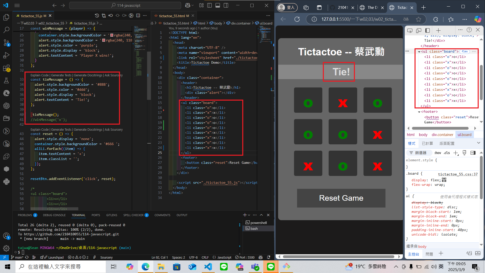

### Github URL

[My Github URL](https://github.com/210410055/114-javascript)

### W02-P1: refine the code in week 1 using ony one compute function

### W02-P2: show winning message and tie message
 
#### ==> play o wins
 

 
#### ==> play x wins
 

 
#### ==> tie
 

### W02-P3: implement reset button
 
#### ==> initially player o win
 

 
#### ==> after reset button is pressed
 

### W02-logs: git logs of W02
 

 
