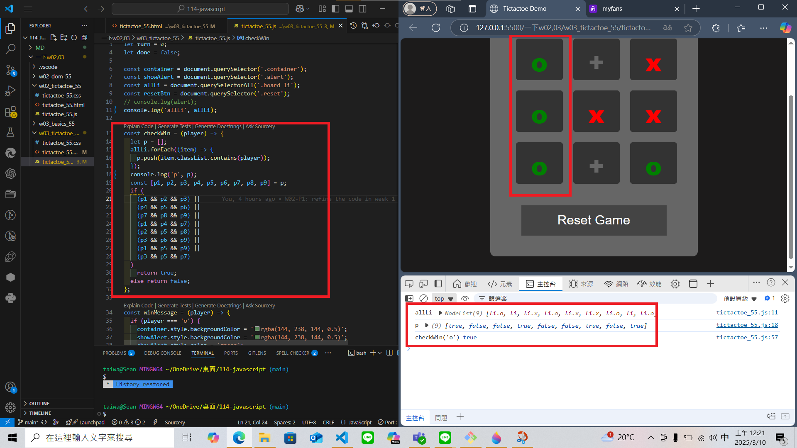
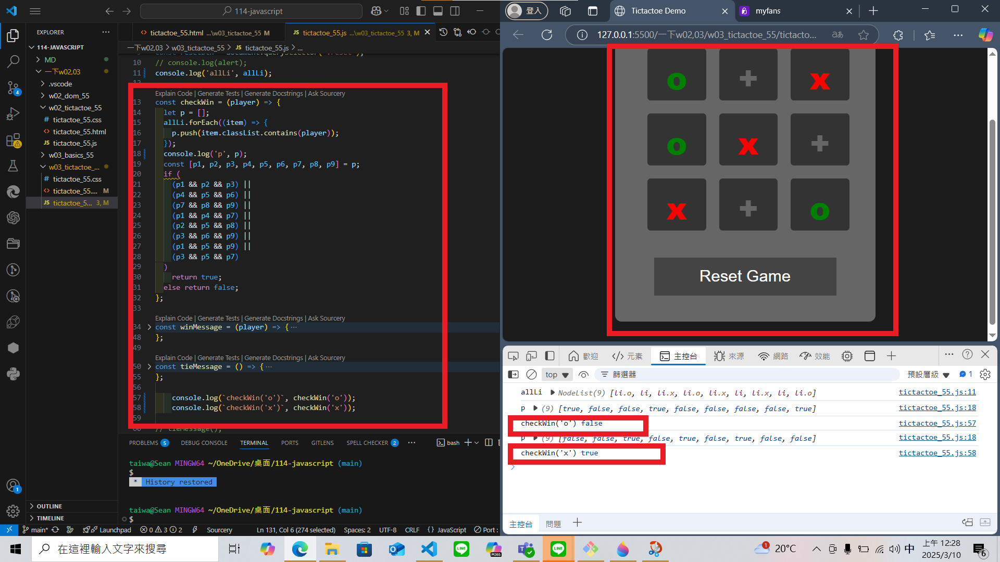
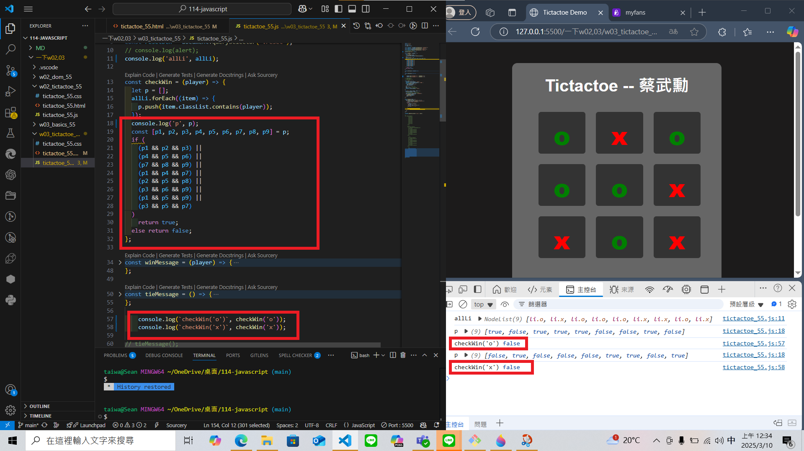
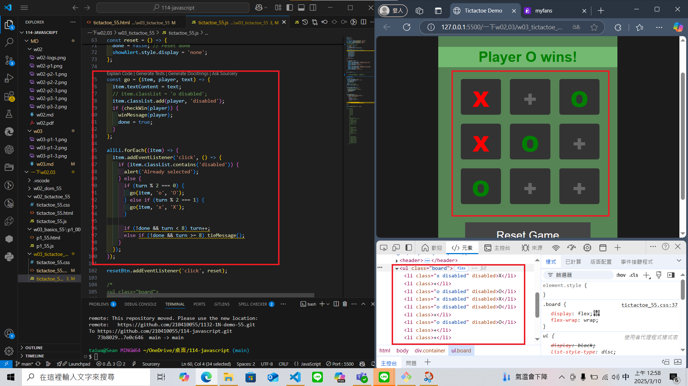
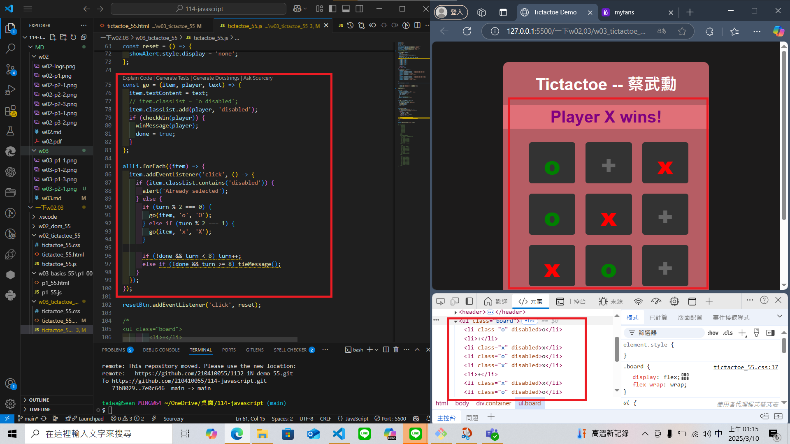
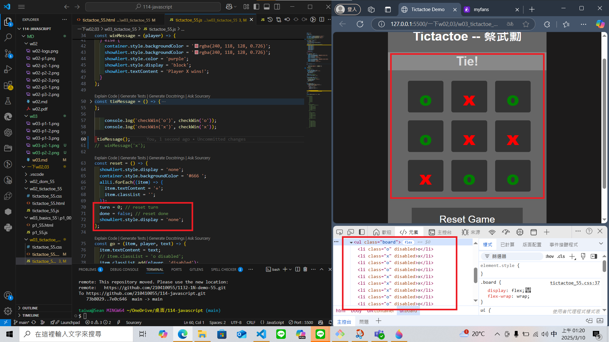
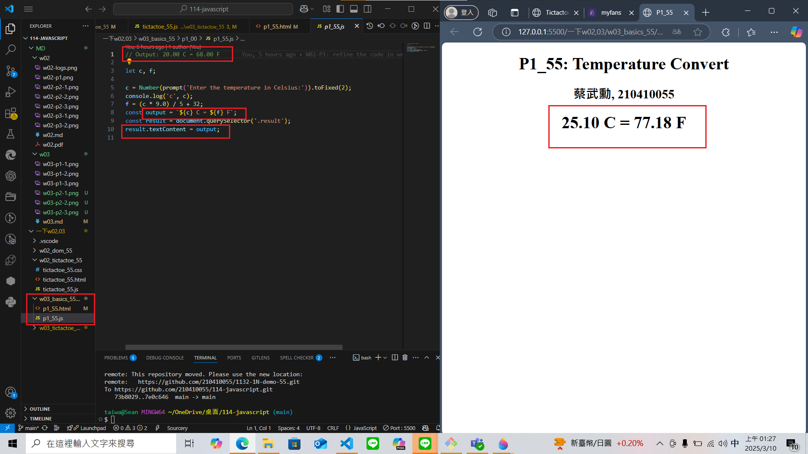
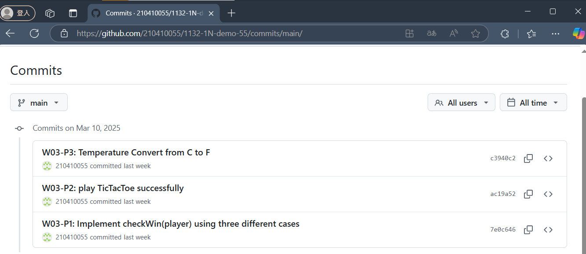

### Github URL

[My Github URL](https://github.com/210410055/114-javascript)

### W03-P1: Implement checkWin(player) using three different cases
 
#### => player o wins
 

 
#### => player x wins
 

 
#### => no player wins
 

### W03-P2: play TicTacToe successfully
 
#### => player o wins
 

 
#### => player x wins
 

 
#### => tie
 

### W03-P3: Temperature Convert from C to F

### W03-logs: git logs of W03
 
