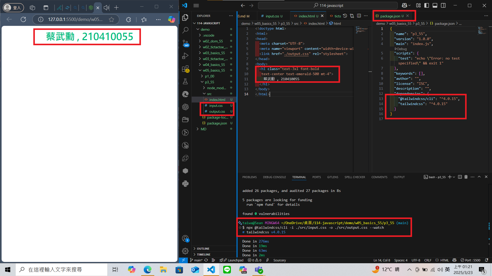
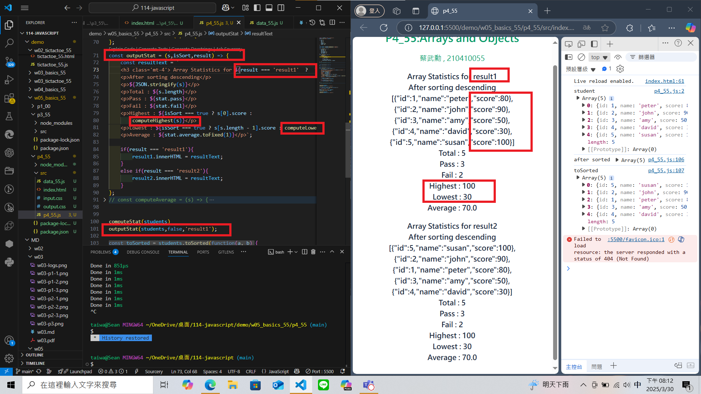
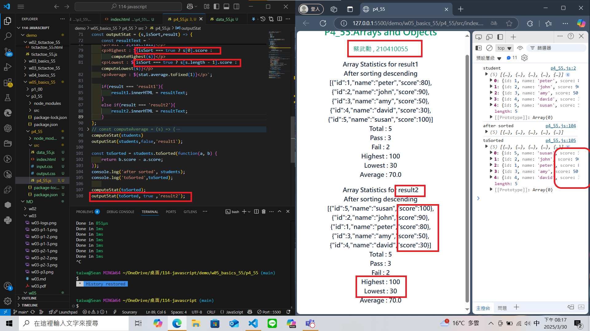

### Github URL

[My Github URL](https://github.com/210410055/114-javascript)

### W05-P1: Use Tailwindcss CLI to show tailwind css without internet access

### W05-P2: use students object array to show statistics
 
#### => no sorting, show in result1 section
 

 
#### => after sorting, show in result2 section
 
