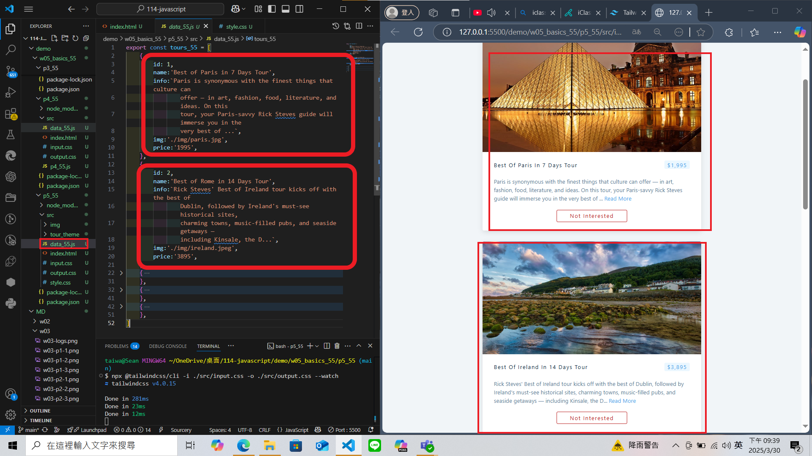

### Github URL

[My Github URL](https://github.com/210410055/114-javascript)

### W05-P1: Use Tailwindcss CLI to show tailwind css without internet access


### W05-P2: use students object array to show statistics
 
#### => no sorting, show in result1 section
 

 
#### => after sorting, show in result2 section
 


### W05-P3: show 5 tours in p5_xx.html using tour theme
 
#### => display 5 tours in tour theme, make tailwind css work as well
 

 
#### => use array tours_xx to store all data of 5 tours
 


### git-log
```
93d6a28 210410055       Sun Mar 30 21:43:37 2025 +0800   W05-P3: show 5 tours in p5_xx.html using tour theme
351986a 210410055       Sun Mar 30 21:42:47 2025 +0800  W05-P2: use students object array to show statistics
f0eda03 210410055       Sun Mar 23 01:32:59 2025 +0800  W05-P1: Use Tailwindcss CLI to show tailwind css without internet access
```