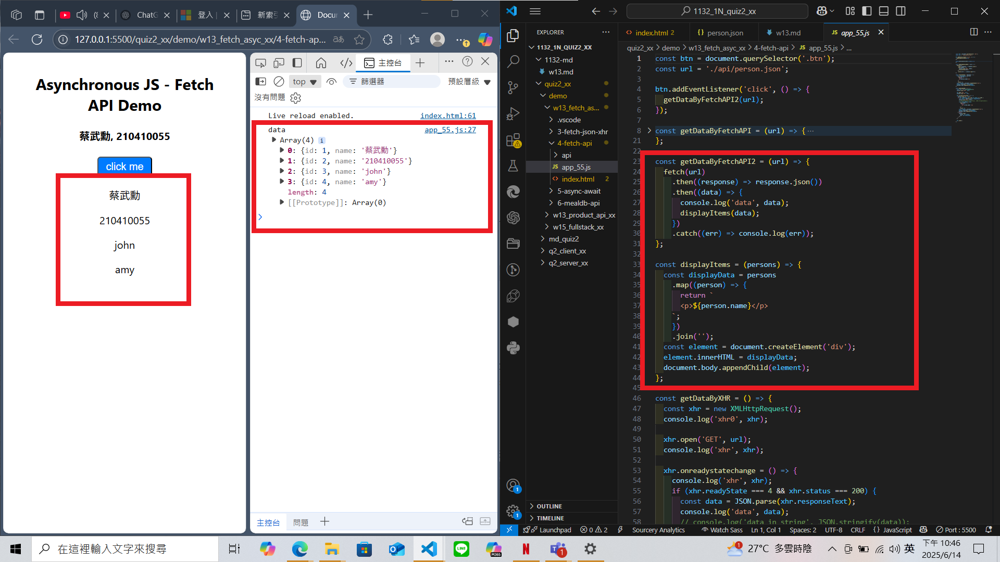
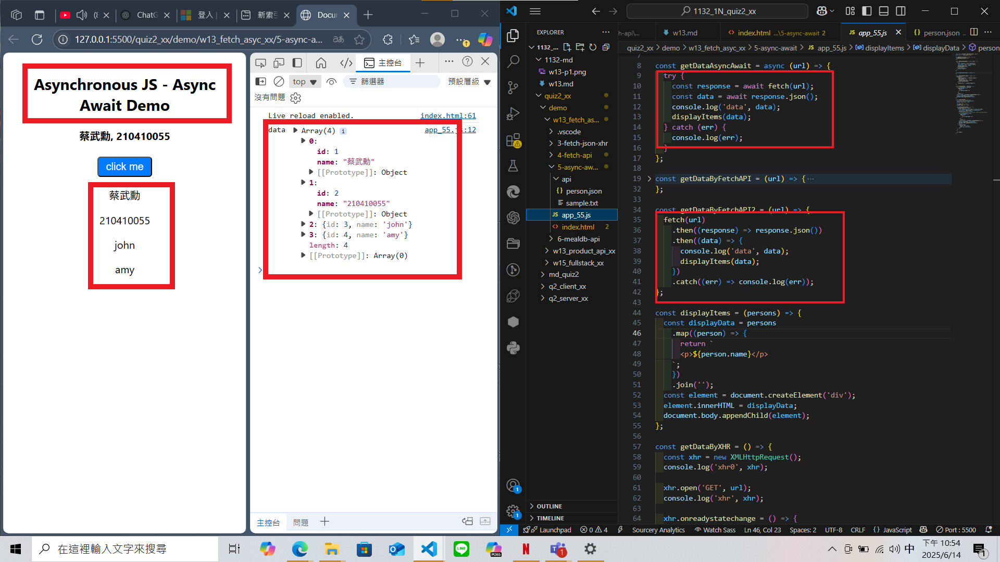
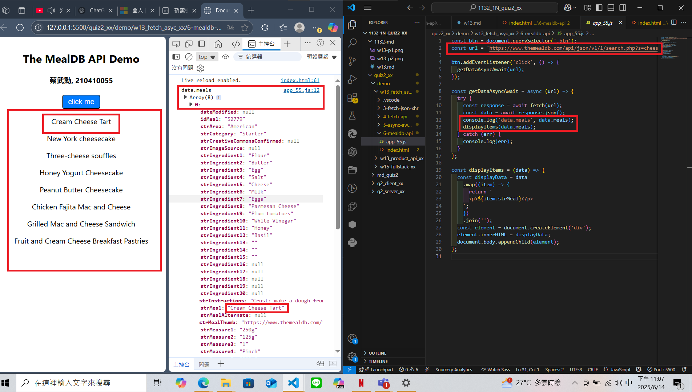
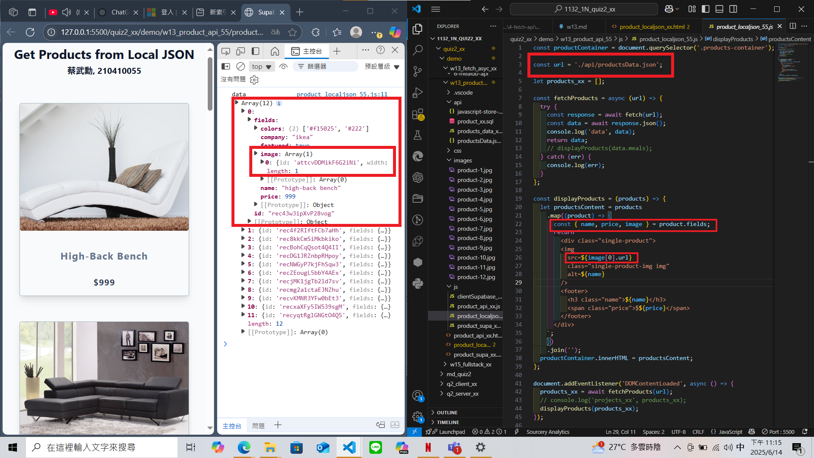
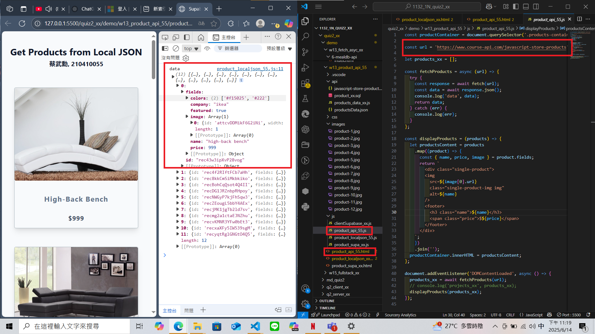

### W13-P1: Use fetch API to replace xhr approach

### W13-P2: Use Async Await to replace fetch API approach

### W13-P3: Get meals about cheese from TheMealDB

### W13-P4: Get Products from local json and from API
 
#### => Get products from local json
 

 
#### => Get products from API
 
