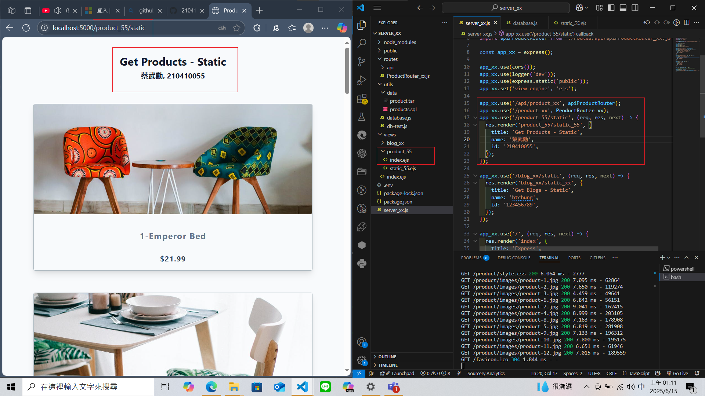
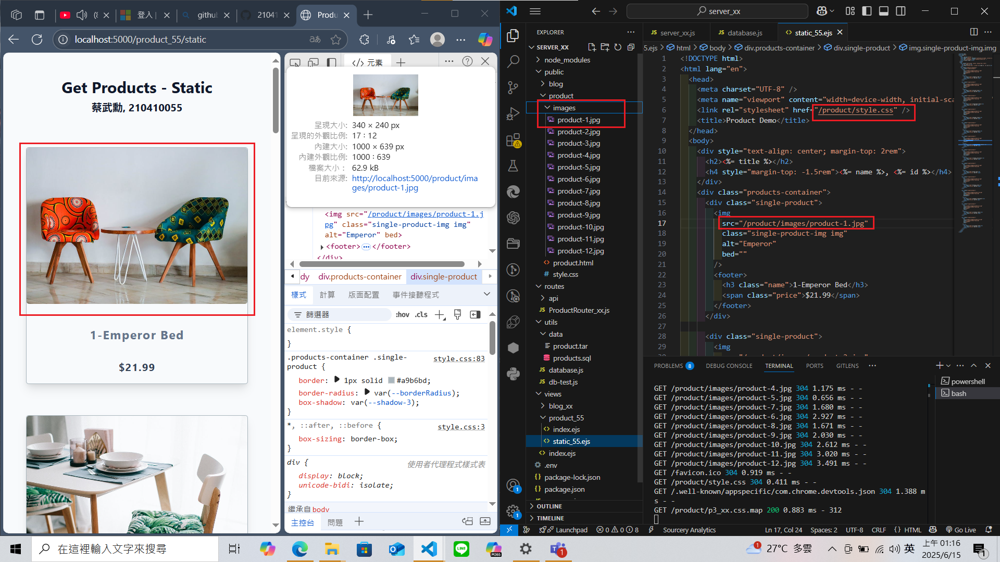
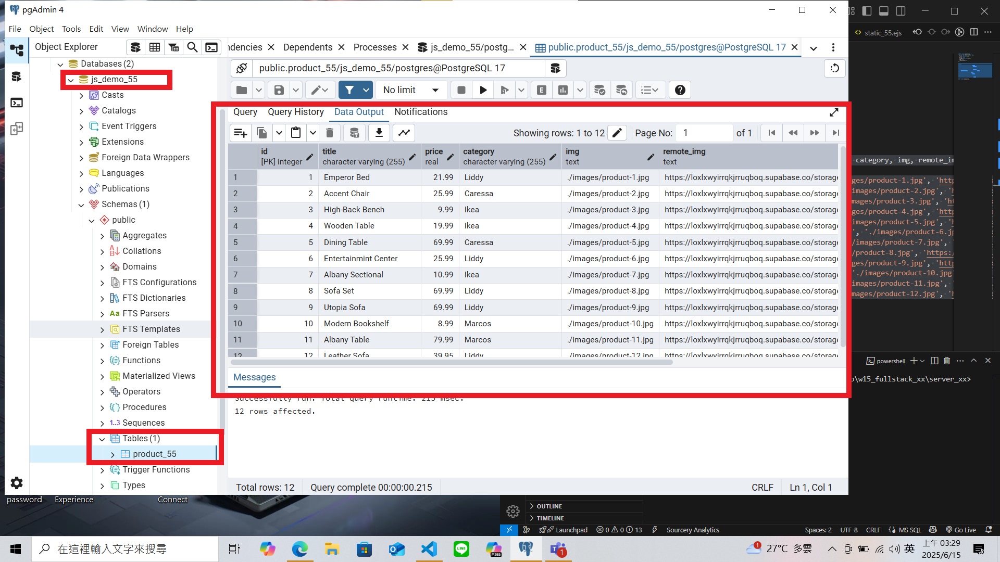
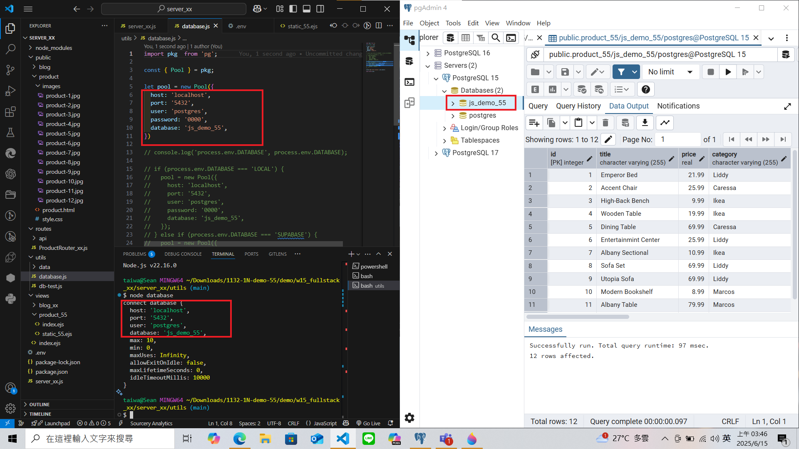
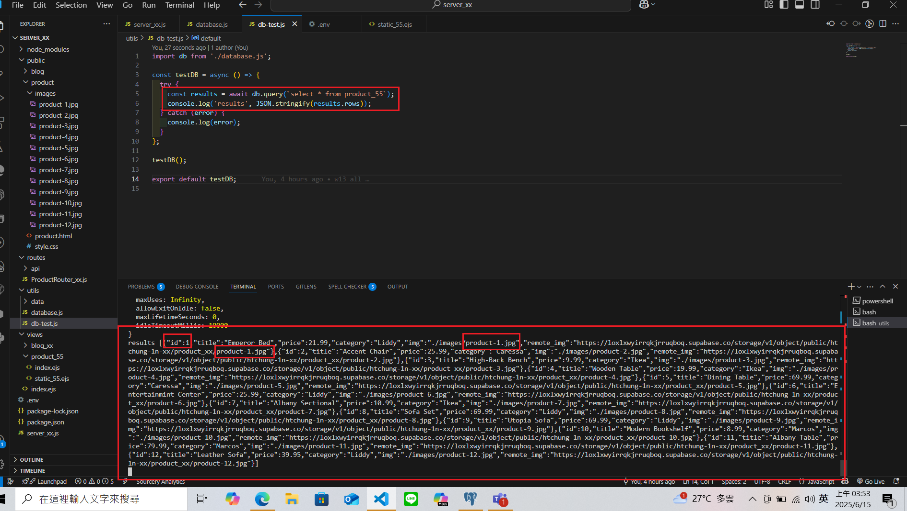

### W14-P1: show first welcome page

### W14-P2: Show static products page
 
#### => show render page with data passed into ejs page
 

 
#### => show how the product-1.jpg can be accessed fro public directory as root directory
 

### W14-P3: Create database js_demo_xx, table product_xx, and insert 12 data, write test code to get all products
 
#### => Create database js_demo_xx, table product_xx, and insert 12 data
 

 
#### => connect js_demo_xx database
 

 
#### => get all product data
 

 