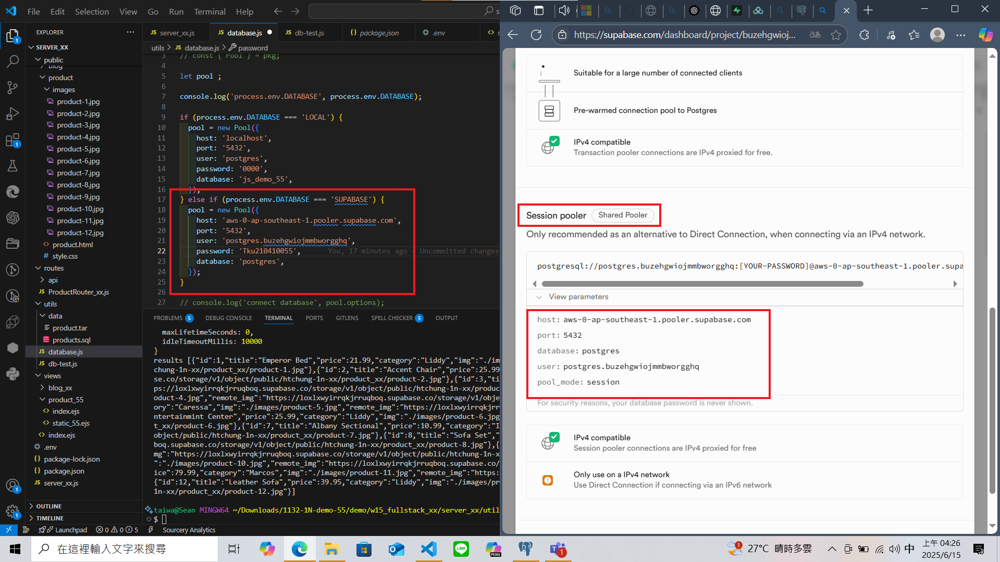
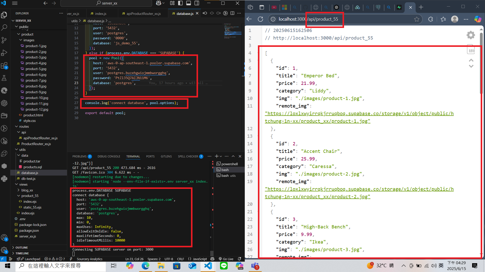
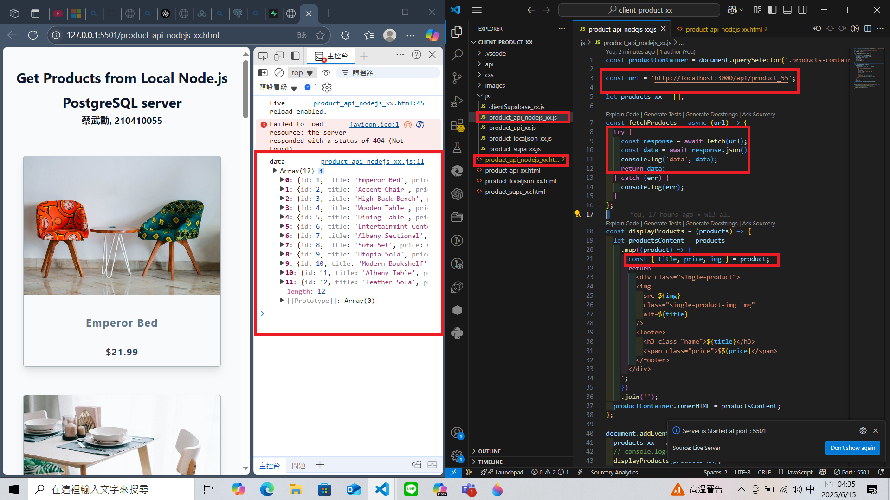
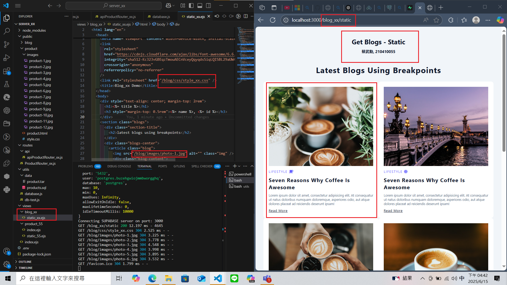
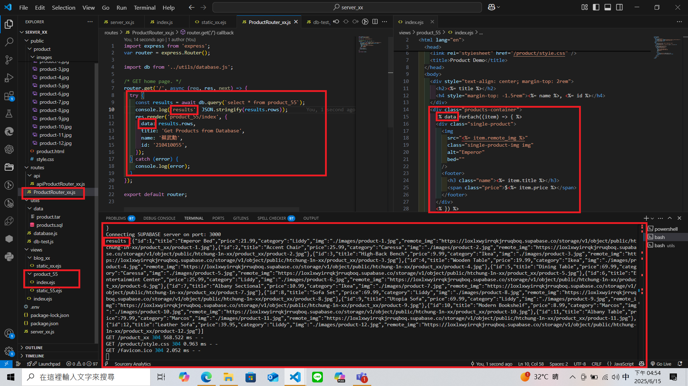
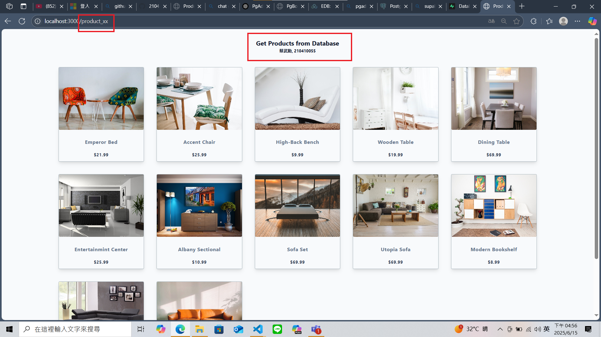

### W15-P1: Set up and test connection to Supabase
 
#### => add support for .env in package.json
 

 
#### => Connection setting to Supabase
 

 
#### => For route /api/product_xx, get json from Supabase
 

 

### W15-P2: Get /api/product_xx json and show it in the client side
 
#### =>
 

### W15-P3: Show static page of blog theme
 

### W15-P4: Implement route /product_xx to get json data from PostgreSQL server and display them in ejs file
 
#### => related code
 

 
#### => Chrome
 
